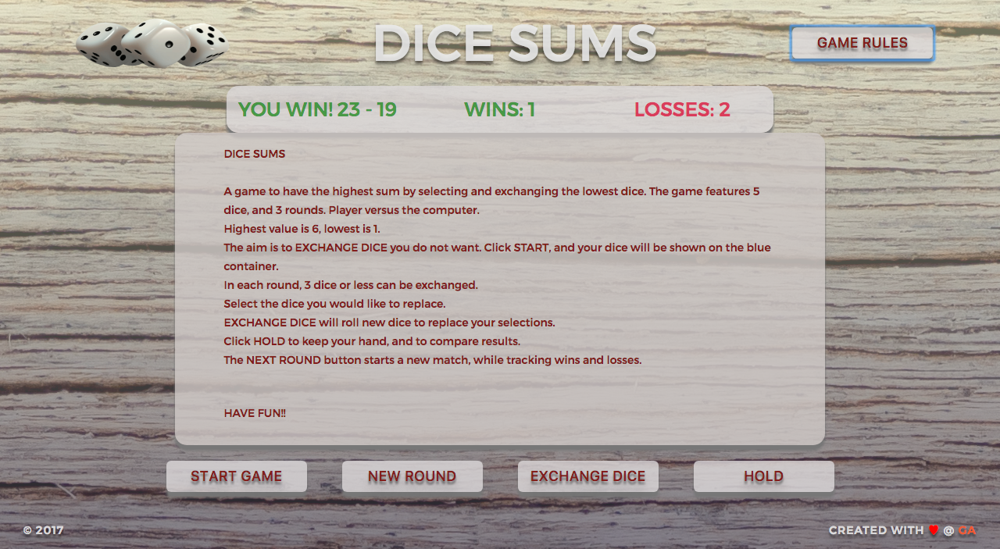
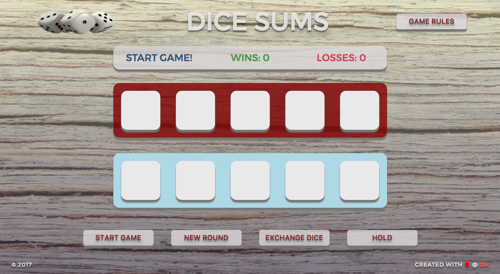
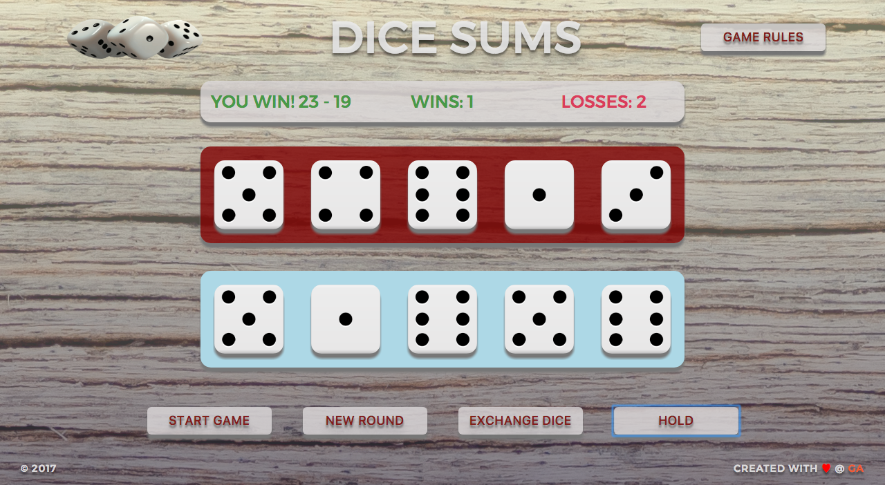

# GA WDI 29 London: Project 1

## Dice sums

*A dice game versus the computer.* [Play it here!](https://dice-sums.herokuapp.com/)

### Rules

### Game Description

The game board is created with a computer player (red), and user player (blue). Upon starting the game the dice will be rolled for both players. The computer's dice are hidden from the user and only revealed when the round of the game is over. The player can select three dice or less before exchanging the dice.
When the dice are exchanged they are rolled in an attempt to created a greater sum. The player has three opportunities to exchange dice before the game ends and the opponents' sums are compared. START GAME resets the win and loss margin. NEW ROUND starts a new round of the same game and will track wins and losses. EXCHANGE DICE rolls new dice after dice have been seleted (6 is highest value 1 is lowest). HOLD can end the game to compare dice.

### Build

* Javascript, jQuery, SCSS & HTML5 were used to create the game.

### Challenges

The main issue was finding a method to track the dice's values when selected to be removed, and keep the current dice with their index and value.

### Moving Forward

This game could move in a few directions with some time and planning. It could create Yahtzee, Poker Dice, Poker, or maybe even Backgammon.
